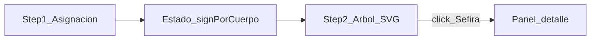

# Plan: Astrology → Tree of Life visual mapper

## What we understood

- **Step 1 — Asignación**: Lista de cuerpos: todos los planetas de tu sistema (incl. Urano, Neptuno, Plutón) **más una fila Ascendente**. Cada fila tiene un desplegable con los 12 signos. Al enviar, el sistema conoce, por cada planeta, el **signo elegido** y puede resolver **letra hebrea + nombre de letra + inteligencia del signo** (tabla signos) y **letra hebrea + nombre + inteligencia del planeta “natural”** (tabla planetas).
- **Step 2 — Árbol**: Pantalla partida: **izquierda**, árbol de la vida interactivo (nodos = Sefirót según tu plantilla); **derecha**, panel de detalle al hacer clic en un nodo: mostrar bloques coherentes (signo asignado a ese planeta, letra/inteligencia del signo; planeta “natural” del nodo, letra/inteligencia del planeta).
- **Idioma**: UI e inteligencias en **español**, alineado a tus tablas.
- **Ascendente**: Fila extra en Step 1; el nodo **Malkuth** se relaciona con Ascendente (no hay fila “planeta natural” de ascendente en la tabla planetas — el panel de Malkuth mostrará solo correspondencia de **signo** o etiquetará Ascendente sin bloque planetario duplicado).

**Mapeo Sefirá → cuerpo** (según tu diagrama; fijado en datos, fácil de ajustar si quieres otra tradición):

| Sefirá    | Cuerpo en el nodo |
| --------- | ----------------- |
| Kether    | Urano             |
| Chokmah   | Neptuno           |
| Binah     | Saturno           |
| Da'at     | Plutón            |
| Chesed    | Júpiter           |
| Geburah   | Marte             |
| Tiphareth | Sol               |
| Netzach   | Venus             |
| Hod       | Mercurio          |
| Yesod     | Luna              |
| Malkuth   | Ascendente        |

## Arquitectura técnica (encaje con el repo)

- Proyecto actual: [package.json](package.json) (Next **16.2**, React 19, Tailwind 4), [src/app/page.js](src/app/page.js) aún es plantilla.
- **Enfoque MVP**: una sola ruta con un componente cliente que alterna `step === 'assign' | 'tree'` (o rutas `/` y `/arbol` si prefieres URLs compartibles; para MVP basta estado en cliente). Opcional: `sessionStorage` para no perder asignaciones al recargar.
- **Datos**: módulo único p. ej. `[src/data/correspondences.js](src/data/correspondences.js)` con:
  - lista de 12 signos (id estable + etiqueta ES);
  - mapa de planetas (clave → `{ hebrewChar, letterName, intelligence }`);
  - definición de filas del formulario (planetas en orden de UI + Ascendente);
  - definición de nodos del árbol (id Sefirá, etiqueta ES, `bodyKey` que enlaza al mapa de planetas o `'ascendant'`).
- **UI** (detalle visual en **Estilo visual** más abajo):
  - Formulario: **shadcn** `Select` + `Label` + `Button` (no abuso de componentes).
  - Árbol: **SVG** con círculos/path lines reutilizando geometría fija (viewBox); colores alineados a *design tokens* (variables CSS); nodos clicables con `role="button"` y foco teclado; símbolos según **Símbolos astronómicos**.
  - Panel derecho: **shadcn** `Card` + `Separator` para secciones “Signo asignado” / “Planeta natural” (Malkuth: segunda sección acortada o omitida).

## Estilo visual: minimal, moderno, místico (+ shadcn / Magic MCP)

- **Intención**: *menos es más* — sensación **mística** por atmósfera (color, luz, proporción), no por iconografía recargada. Evitar clichés ruidosos (fondos de galaxia, exceso de bordes dorados, sombras fuertes). Una **jerarquía clara**, mucho aire, bordes finos, estados de foco visibles.
- **Paleta (orientación)**: base **oscuro suave** (casi negro o pizarra con matiz violeta muy contenido); texto alto contraste pero no blanco puro; **un acento único** (ámbar/dorado apagado o violeta claro) reservado a acciones primarias, nodo activo del árbol, y detalles de énfasis. Superficies: tarjetas ligeramente elevadas del fondo (border + blur muy sutil opcional).
- **Tipografía latina**: mantener **Geist** para UI en español; títulos pueden usar el mismo (consistente y moderno) salvo que más adelante se añada una *display* puntual para el hero — sin mezclar demasiadas familias.
- **shadcn/ui**:
  - El repo **aún no** incluye shadcn; habrá que **inicializarlo** (`npx shadcn@latest init` o flujo actual de la documentación) verificando compatibilidad con **Next 16** + **Tailwind 4**; si el CLI requiere ajustes, seguir la guía oficial actualizada.
  - **Usar con criterio**: `Button`, `Select`, `Card`, `Label`, `Separator` cubren la mayor parte del producto. **No** armar un catálogo de patrones (sin `Sheet`/`Dialog` salvo necesidad, sin tablas, sin animaciones ornamentales masivas).
  - Tema: modo **dark** como principal; variables HSL/CSS de shadcn personalizadas para la atmósfera descrita; componentes `data-slot` donde aplique para no pelear con Tailwind v4.
- **Magic MCP** (cuando implementemos): consultar **solo** para ideas de **layout** (p. ej. split view, ritmo del panel, cómo agrupar el formulario) y adaptar lo mínimo al estilo anterior — **no** copiar bloques completos ni saturar de “SaaS chrome”; el árbol sigue siendo SVG custom.
- **Árbol**: líneas y nodos con trazos limpios; nodo seleccionado = acento sutil (anillo o glow mínimo); Da’at con trazo punteado como en tu referencia.

## Tipografía hebrea (Google Fonts)

- **Sí**: Google Fonts incluye varias familias con soporte **hebreo**; no hace falta un archivo local salvo que quieras una fuente concreta fuera de GF.
- **Fuente en la implementación**: cargar con `next/font/google` en [`src/app/layout.js`](src/app/layout.js) (igual que `Geist` hoy), con `subsets: ['hebrew']` (y `latin` si la familia lo usa para metadata). Ejemplos habituales:
  - **[Noto Sans Hebrew](https://fonts.google.com/noto/specimen/Noto+Sans+Hebrew)** — muy legible, neutra, buena para UI.
  - **[Frank Ruhl Libre](https://fonts.google.com/specimen/Frank+Ruhl+Libre)** — estilo “libro”/serif, muy usada para hebreo de lectura.
  - Otras en GF con hebreo: **Rubik**, **Heebo**, **Assistant**, etc.
- **Uso**: exportar la fuente con `variable: '--font-hebrew'` (o nombre fijo), añadir la variable a `<html className={...}>`, y aplicar una clase utilitaria (Tailwind `font-[family-name:var(--font-hebrew)]` o extensión en `@theme` según cómo esté [`globals.css`](src/app/globals.css)) **solo donde se muestran caracteres hebreos** (p. ej. panel de desglose y, si se etiquetan letras en el SVG, esos `<text>`), manteniendo Geist (o la fuente UI que elijas) para el resto del español.
- **RTL (dirección)**: el hebreo es RTL; para una **sola letra** suele verse bien en un panel LTR; si más adelante hay frases completas en hebreo, habrá que usar `dir="rtl"` / `unicode-bidi` donde corresponda.

## Símbolos de planetas y signos (zodíaco)

No usamos una “fuente de astrología” rara aparte: los glifos estándar viven en **Unicode** (bloque *Miscellaneous Symbols* y afines). Ejemplos: zodíaco **♈–♓** (Aries–Piscis, U+2648–U+2653); planetas clásicos y modernos **☉ ☽ ☿ ♀ ♂ ♃ ♄ ♅ ♆ ♇** (Sol, Luna, Mercurio, Venus, Marte, Júpiter, Saturno, Urano, Neptuno, Plutón).

**El problema**: muchas fuentes de UI (p. ej. Geist) **no incluyen** esos glifos; el navegador hace *fallback* a otra fuente del sistema, y en algunos sistemas el resultado es feo, inconsistente o cuadro vacío.

**Estrategia MVP (recomendada)**:

1. **Google Fonts + `next/font/google`**: cargar **[Noto Sans Symbols 2](https://fonts.google.com/noto/specimen/Noto+Sans+Symbols+2)** (u otra Noto “Symbols” con buena cobertura) como `--font-symbols` y aplicarla solo a elementos que muestran estos caracteres (etiquetas del árbol, opcionalmente iconos junto al `Select`). Coexiste con la fuente hebrea y con Geist para texto.
2. **Reserva opcional**: si en algún entorno aún falla un glifo, sustituir **solo ese** símbolo por un **path SVG** embebido (misma silueta en todos los dispositivos); los 12 signos + 10 planetas son un conjunto pequeño y estable.

**Ascendente**: no hay un carácter Unicode único y universal como “logo del ascendente”; en tu diagrama aparece **“Asc”** como texto. En la implementación: **texto “Asc”** (o abreviatura acordada) en Malkuth, no depender de un solo codepoint raro.

Los caracteres concretos por signo/planeta vivirán en la capa de datos (p. ej. `zodiacChar`, `planetChar`) para una sola fuente de verdad.

## Detalles ya cubiertos (no hace falta que los mandes de nuevo)

- Tablas signos/planetas → intelecto + letra hebrea (nota menor: en la tabla aparece “Vod” para Tauro; en datos usaremos nombre estándar **Vav** salvo que quieras la ortografía exacta del material).
- Inclusión de **Da'at** (borde punteado en diseño): se puede reflejar con `stroke-dasharray` en SVG.

## Riesgos / límites asumidos

- Un solo “mapa” fijo Sefirá–planeta; no editor de correspondencias en la app v1.
- No cálculo de carta astral: solo lo que el usuario elige en desplegables.

## Archivos principales a tocar

- Inicializar **shadcn** (p. ej. `components.json`, `src/components/ui/*`, dependencias Radix asociadas) y actualizar [`src/app/globals.css`](src/app/globals.css) con variables de tema acorde al apartado **Estilo visual**.
- Reemplazar contenido de [src/app/page.js](src/app/page.js) y exportar flujo principal (o páginas bajo `src/app/` si se elige ruta `/arbol`).
- Añadir `src/data/correspondences.js` y componentes de feature bajo `src/components/…` (p. ej. `AssignmentStep`, `TreeStep`, `TreeSvg`, `BreakdownPanel`), componiendo con primitivas `ui/` solo donde aporte.
- Ajustar metadatos en [src/app/layout.js](src/app/layout.js) (título/descripción en español) y registrar fuentes (hebreo + símbolos) como ya se describió.

No es necesario leer guías de Next salvo si chocamos con APIs nuevas (p. ej. `"use client"` en límites de servidor); si aparece deprecación al construir, consultar `node_modules/next/dist/docs/` como indican las reglas del workspace.
